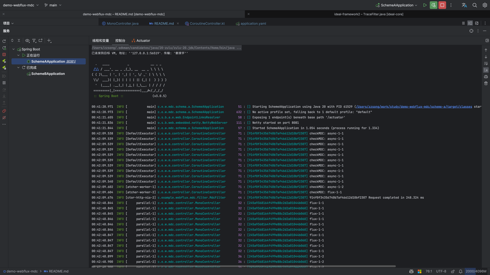
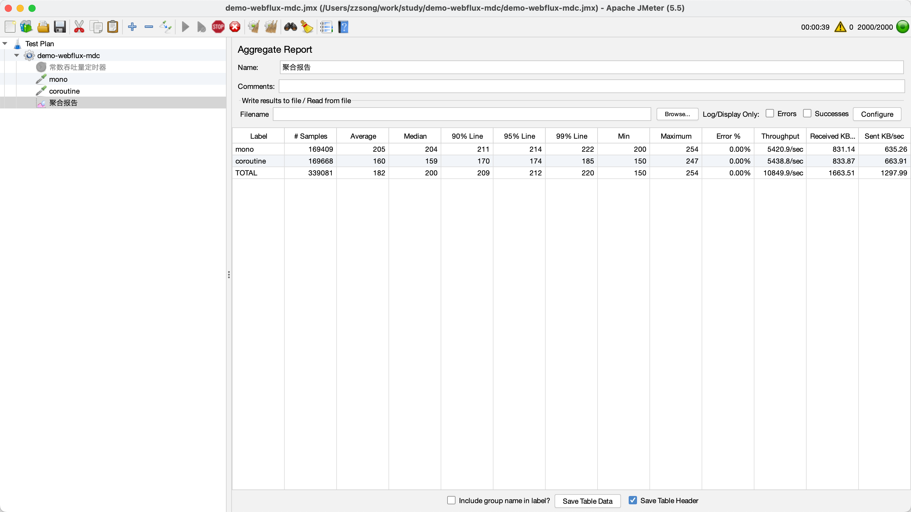
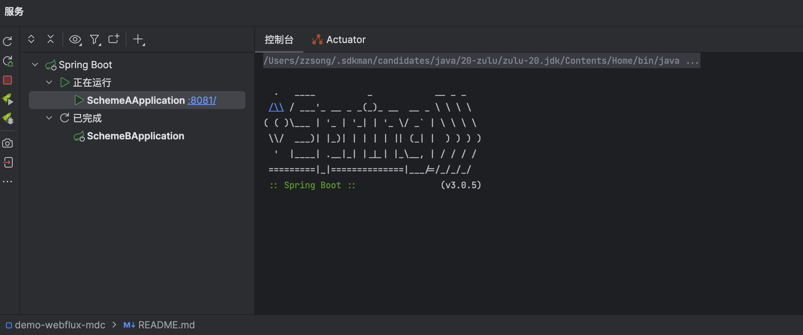

测试在spring-webflux和kotlin协程环境下如何准确的传递slf4j的MDC信息.

目标是在协程中能够正确的进行链路追踪与日志打印.

## 实现方案

### 在过滤器中设置TraceId

```java

@Component
public class MdcFilter implements WebFilter, Ordered {
  private static final Logger log = LoggerFactory.getLogger(MdcFilter.class);

  @Nonnull
  @Override
  public Mono<Void> filter(@Nonnull ServerWebExchange exchange,
                           @Nonnull WebFilterChain chain) {
    long nanoTime = System.nanoTime();
    String traceId = UUID.randomUUID().toString().replace("-", "");
    Map<String, String> mdcContextMap = Map.of(Constants.TRACE_ID_HEADER, traceId);
    MDC.setContextMap(mdcContextMap);
    exchange.getResponse().getHeaders().set(Constants.TRACE_ID_HEADER, traceId);
    return chain.filter(exchange)
      .then(
        Mono.<Void>fromRunnable(() -> {
            MDC.setContextMap(mdcContextMap);
            long elapsed = System.nanoTime() - nanoTime;
            long micro = elapsed / 1000;
            double mills = micro / 1000D;
            Utils.checkMDC(traceId, "MDC filter");
            log.info("{} Request completed in {} ms", traceId, mills);
          })
          .contextWrite(Context.of(Constants.MDC_KEY, mdcContextMap))
      )
      .contextWrite(Context.of(Constants.MDC_KEY, mdcContextMap));
  }

  @Override
  public int getOrder() {
    return Ordered.HIGHEST_PRECEDENCE + 1;
  }
}
```

### 在Reactor中传递MDC信息

方案A在执行Subscriber的onNext方法时从上下文中获取需要传递的信息,并写入MDC中.

方案B借助`io.micrometer:context-propagation`注册ThreadLocalAccessor.

### 在kotlin协程中传递MDC信息

每次在需要获取MDC信息的地方(例如打印日志时)都需要手动从ReactorContext中获取需要传递的信息,并写入MDC.

```java
public class Utils {

  /**
   * 从ReactorContext中获取需要传递的信息
   */
  @Nonnull
  public static Mono<Map<String, String>> getMDCContext() {
    return Mono.deferContextual(view -> {
      if (view.isEmpty() || !view.hasKey(Constants.MDC_KEY)) {
        return Mono.just(Map.of());
      }
      Object o = view.get(Constants.MDC_KEY);
      Map<String, String> ctx = (Map<String, String>) o;
      return Mono.just(ctx);
    });
  }
}
```

```kotlin
class Test {
  private val log = LoggerFactory.getLogger(Test::class.java)

  /**
   * 输出日志, 此时输出的日志将能打印MDC中的信息
   *
   * 如果每次打日志都需要手动设置MDC的话未面太麻烦了, 可以对SLF4j进行简单的封装.参考[com.example.webflux.mdc.logging.LocationAwareSuspendLogger]
   */
  suspend fun <T> test() {
    val ctx = Utils.getMDCContext().awaitSingle()
    MDC.setContextMap(ctx)
    log.info("输出日志")
  }
}
```

## 测试

### 功能测试

目标: 成功在日志中输出TraceId



### 压力测试

在Reactor和协程中使用以下方法对功能正确性进行测试, 日志级别修改为ERROR.

```java
public class Utils {

  /**
   * 验证MDC中的traceId与是否与预期值一致
   *
   * @param target 预期的traceId值
   * @param mark   标记调试位置
   */
  public static String checkMDC(@Nonnull String target, @Nonnull String mark) {
    String traceIe = MDC.get(Constants.TRACE_ID_HEADER);
    if (!target.equals(traceIe)) {
      log.error("{} MDC value not matching {} -> {}", mark, target, traceIe);
    }
    return traceIe;
  }
}
```

jmeter开启2000个线程对两个接口进行压测, 压测目标: 上述方法不输出error日志.

jmeter压测报告如下:


未输出error日志, 说明功能实现正确.
